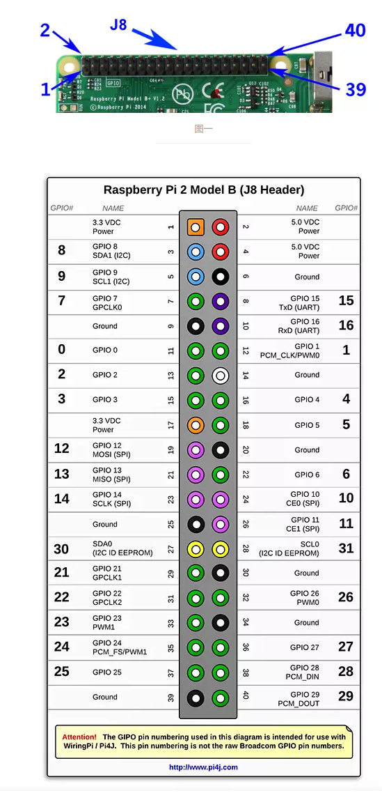
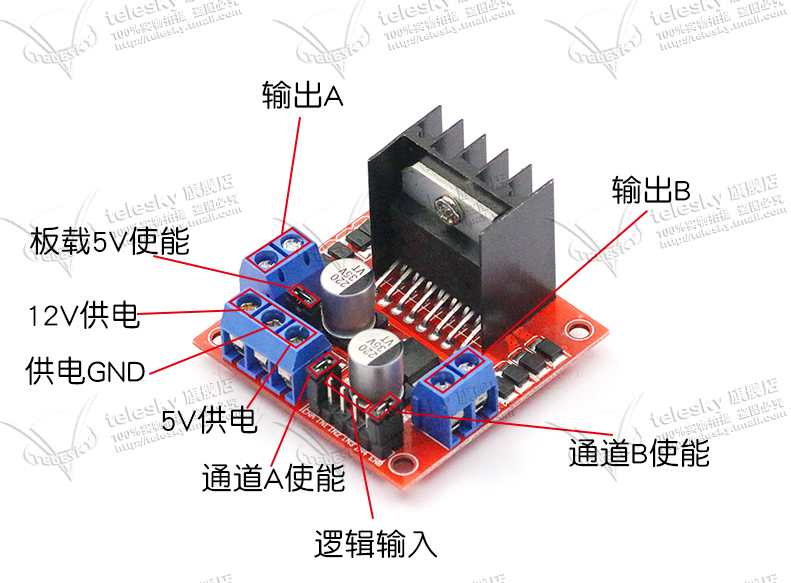

# rasp-car-server
树梅派小车服务端，客户端在[这里](https://github.com/chengda/rasp-car-client)

## 1. 硬件介绍
- 主控板：树梅派3B+
- 电机驱动： L298N直流电机驱动模块
- 电机： 两个12V直流电机
- 电池： 旧笔记本电池组拆机锂电池，3节3.7V串联

## 2. 接线
### 2.1. Pi4j 介绍

Java代码中通过pi4j控制树梅派的GPIO。



### 2.2. L298N电机驱动模块介绍



- IN1~IN4 四个逻辑输入口，通过电平高低控制两组电机输出，控制两台电机的正反转。通过PWM可以控制速度，本项目中暂未实现。
- IN1.IN2 控制输出A，IN3、IN4控制输出B，至于正反转跟接线有关，实际试一下就可以了。

### 2.3. 接线说明

树梅派的GPIO 00～03, 依次分别链接IN1~IN4，电源正确连接即可，注意正负极和电压匹配。

## 2. 源码编译打包

- 客户端更新（可选）

    客户端源码在[这里](https://github.com/chengda/rasp-car-client)，编译后的客户端代码放置在/src/main/resources/static/下面，这是springboot的默认规则。

- 编译打包

    ```
    mvn -U -e clean package
    ```

## 3. 安装部署
### 3.1. 安装摄像头驱动软件

```
sudo apt-get install motion
```
- 修改配置文件：/etc/default/motion，设置适当的分辨率
```
    width: 640
    height: 480
```
- 启动motion设置开机启动
```
    systemctl start motion
    systemctl enable motion
```
- 启动后motion会监听8080和8081端口，其中8081端口就是视频流。

### 3.2. 部署rasp-car服务端
- 在/home/pi下新建rasp-car目录作为服务端的根目录
- 把前面编译打包好的rasp-car-server-1.0.0-SNAPSHOT.jar上传到这个目录下
- 在该目录下新建启动脚本startup.sh，内容如下：
```
#!/bin/bash

RASP_CAR_HOME=$(cd $(dirname ${BASH_SOURCE}) && pwd)

echo "RASP_CAR_HOME:${RASP_CAR_HOME}"

nohup java -Dserver.port=80 -jar ${RASP_CAR_HOME}/rasp-car-server-1.0.0-SNAPSHOT.jar > ${RASP_CAR_HOME}/rasp-car.log
```
- 新建systemctl配置文件，/usr/lib/systemd/system/rasp-car-server.service，内容如下：
```
[Unit]
Description=raspberry car server
After=network.target

[Service]
ExecStart=/home/pi/rasp-car/startup.sh

[Install]
WantedBy=multi-user.target

```
- 启动rasp-car服务
```
sudo systemctl start rasp-car-server
```
- 设置开机自动启动
```
sudo systemctl enable rasp-car-server
```